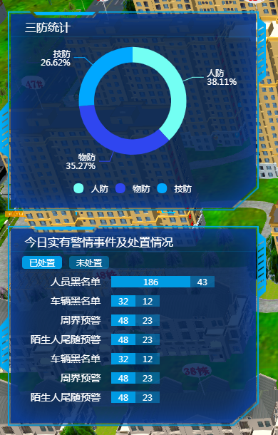

1. `pointer-events` 样式的作用
```css
/*左侧信息窗口样式*/
.left-win-box {
    position: absolute;
    top: 20px;
    left: 10px;
    bottom: 20px;
    display: flex;
    flex-direction: column;
    pointer-events: none;     /*pointer-events: auto;*/
    color: #fff;
}
```
2. 动画样式
```css
.left-win-box.closed {   
    animation: leftSlideOut .5s forwards;
}
.left-win-box.opened {   
    animation: leftSlideIn .5s forwards;
}

@keyframes leftSlideIn {
    from {transform: translateX(-110%) }
    to {
        transform: translateX(0);
    }
}
@keyframes leftSlideOut {
    from {transform: translateX(0) }
    to {
        transform: translateX(-110%);
    }
}

@keyframes slideToRight {
    from { transform: translateX(0); }
    to {
        transform: translateX(110%)
    }
}
@keyframes slideToLeft {
    from { transform: translateX(110%); }
    to {
        transform: translateX(0)
    }
}
.realtime-records.closed {    
    animation: slideToRight .5s forwards;
}
.realtime-records.opened {    
    animation: slideToLeft .5s forwards;
}
```
3. `echarts`使用
```js
// 首先要安装, yarn add echarts
/*
<!-- 三防统计 -->
<div class="leftsmallbox sanfangtongji">
    <h2>三防统计</h2>
    <div class="content-container" style="height: 216px">
        <div ref="sanfangtongjiinfo" style="width: 100%; height: 100%;">

        </div>
    </div>
</div>
*/

import echarts from 'echarts'
export default {
    data() {
        return {
            closed: false,
            sanfangChart: null
        }
    },
    computed: {
        openCloseClass() {
            return this.closed? 'closed':'opened'
        }
    },
    mounted() {
        this.sanfangChartInit()
    },
    methods: {
        toggleOpenClose() {
            this.closed = !this.closed
        },
        sanfangChartInit() {
            var option = {
                tooltip: {
                    trigger: 'item',
                    formatter: "{b}<br>{c} ({d}%)",
                    position: 'inside'
                },
                color: ['#73fff3','#2f46f0','#00a8ff'],
                legend: {
                    bottom:'-5',
                    textStyle:{
                        color:'white'
                    },
                    x: 'center',
                    data:[
                        {name:'人防',icon:'circle'},
                        {name:'物防',icon:'circle'},
                        {name:'技防',icon:'circle'}
                    ]
                },
                series: [
                    {
                        type:'pie',
                        hoverOffset:5,
                        center: ['50%','40%'],
                        radius: ['50%', '70%'],
                        avoidLabelOverlap: false,
                        label: {
                            color: '#fff',
                            formatter: '{b}\n{d}%'
                        },
                        data:[
                            {value:335, name:'人防'},
                            {value:310, name:'物防'},
                            {value:234, name:'技防'}
                        ]
                    }
                ]
            }
            var sanfangechart =  echarts.init(this.$refs.sanfangtongjiinfo);
            sanfangechart.setOption(option, true)
            this.sanfangChart = sanfangechart
        }
    },
    components: {
        RealtimeRecords
    }
}
```


3. [`openlayers`放大和缩小](https://openlayers.org/en/latest/examples/animation.html)
```js
methods: {
    ...
    zoomout: function() {
        var view = this.map.getView()
        if (Number(view.getZoom()) < 19) {
            view.animate({
                zoom: view.getZoom() + 1
            })
        }
    },
    zoomin: function() {
        var view = this.map.getView()
        if (Number(view.getZoom()) > 1) {
            view.animate({
                zoom: view.getZoom() - 1 
            })
        }
    },
    ...
}
```
4. 定义字体样式
```css
@font-face
{
	font-family: 'data-font';
	src: url('./font/datafont.TTF')
}

/*使用*/
.contentdiv {
    height: 30px;
    line-height: 30px;
	width: 140px;
	background-image: url('../assets/images/infodiv.png');
	background-size: 100% 100%;
    text-align: center;
	font-family: 'data-font';
	color: rgb(199, 233, 10);
	font-size: 20px;
	font-weight: bold;
    letter-spacing: 6px;
    padding-left: 5px;
    text-shadow:2px 2px 8px rgba(30,136,229,1),-2px -2px 8px rgba(30,136,229,1);
}
```

5. 内阴影样式
```css
box-shadow: 0px 0px 30px 14px rgba(0,66,255,.32) inset;
```
6. 组件定义slot - 增强通用性 `src/components/common/comdialog.vue`
```js
<template>
    <div class="comdialog">
        <div class="header">
            <div class="title">
                <slot name="header">
                    标题
                </slot>
            </div> 
            <div class="headerright">
                <i class="icon iconfont icon-ellipsis"></i>
                <i class="icon iconfont icon-close" @click="closeComDialog"></i>
            </div>           
        </div>        
        <slot>
            <div class="dialogcontent">
                dialog default content
            </div>
        </slot>
    </div>
</template>

<script>
    export default {
        methods: {
            closeComDialog() {
                this.$emit('closeComDialog')
            }
        }
    }
</script>

<style scoped>
.comdialog {
    height: 100%;
    background: none;   
    color: #fff;
    border: 1px solid rgba(3,92,176,1)
}
.header {
    height: 26px;
    line-height: 26px;
    font-size: 12px;
    padding: 0 8px;
    display: flex;
    align-items: center;
    justify-content:space-between;
    background-color: rgba(1,104,203,.7);
}
.headerright {
    color: #fff;
}
.headerright>i {
    cursor: pointer;
    margin-left: 3px;
}
</style>
```